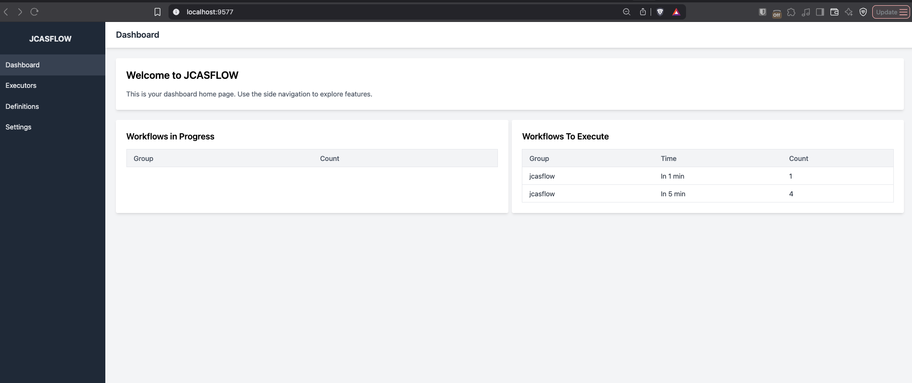
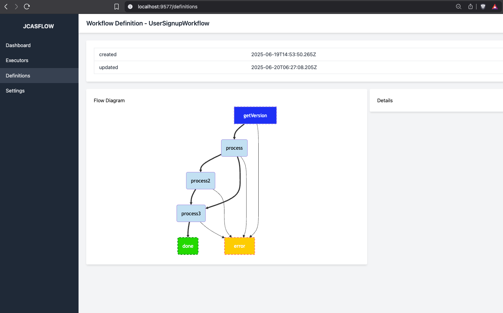

# **JCASFLOW**

A DAG (Directed Acyclic Graph) distributed, fault tolerant workflow engine leveraging a Casandra database with LWT transactions 

### this project is currently in Beta development, use with caution but contributions are welcome.

### Why build yet another workflow engine?

* there are many workflow engines that use BPMN or DSL to define workflows, but quite often Developers design the flows and not business
* from code to define the rules and logic
* the engine is designed to be used by developers, not business users
* handles retries and failures
* by using casandra the database can be distributed and scaled horizontally
* this is more for reliable and robust workflows AKA durable execution of code

### Hello world

first you need to have a running Cassandra database, there is a working compose file in the root directory, this starts a singled node Cassandra instance and listens on port 9042

    docker compose -f "DockerComposeCasandra" up -d

run the below from the root directory

have a look at the UserSignupWorkflow in the example module.

    cd jcasflowEngine;
    mvn clean install;
    cd ../ ;
    cd jcasflowWeb;
    mvn clean install;
    cd ../ ;
    cd jcasflowExample;
    mvn clean install;
    mvn spring-boot:run;

open the url 

    http://localhost:9577

Licence Apache 2.0

